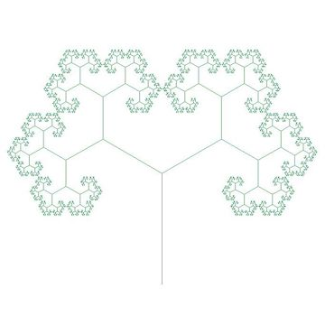

<p align="center">
  
</p>

# datastructures
Simple javascript implementations of data structures. Currently this application was written and maintained to demonstrate test driven development and testing strategies within a React context.

## Getting Started
First, clone this project to a local directory. Next, execute yarn install to download relevant dependencies. Yarn can be downloaded [here](https://yarnpkg.com/lang/en/docs/install/).

## Running the tests
Create react application uses Jest for code coverage. There are two testing scripts located in the package.json. Use ```yarn test``` to watch relevant files for changes, or ```yarn run coverage``` to visualize code coverage via the CLI or the produced html file under the coverage directory.

## Built With
[create-react-app](https://github.com/facebook/create-react-app) - Friendly utility to generate basic files for a React application. Generously provided by Facebook.
